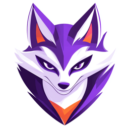

# Mokksy anf AI-Mocks



Mock LLM implementations, inspired by wiremock, but with response streaming and SSE.

[](https://github.com/kpavlov/ai-mocks/actions/workflows/maven.yml)
[](https://app.codacy.com/gh/kpavlov/ai-mocks/dashboard?utm_source=gh&utm_medium=referral&utm_content=&utm_campaign=Badge_grade)
[](https://app.codacy.com/gh/kpavlov/ai-mocks/dashboard?utm_source=gh&utm_medium=referral&utm_content=&utm_campaign=Badge_coverage)
[](https://kpavlov.github.io/ai-mocks/api/)

## Overview

Mokksy and AI-Mocks is a project that provides mock LLM implementations, inspired by wiremock and mockito. It allows users to mock OpenAI API responses for testing and development purposes.

[Mokksy](mokksy/README.md) is Mock HTTP Server, built with [Kotlin](https://kotlinlang.org/) and [Ktor](https://ktor.io/).

AI-Mocks is specific Mock server implementations, like ai-mocks-openai, built with Mokksy.

## Mocking OpenAI API

First, yu need to create a mock server and setup mock response, similar to how you do it for Wiremock:
```kotlin
val openai = MockOpenai(verbose = true)

openai.completion {
  temperature = temperatureValue
  seed = seedValue
  model = "gpt-4o-mini"
  maxCompletionTokens = maxCompletionTokens
} responds {
  textContent = "Hello"
  finishReason = "stop"
}
```

Then you need an openai client, e.g. official OpenAI client:
```kotlin
val client: OpenAIClient =
  OpenAIOkHttpClient
    .builder()
    .apiKey("any-key")
    .baseUrl("http://127.0.0.1:${openai.port()}/v1") // connect to mock OpenAI
    .responseValidation(true)
    .build()
```
Now, you may call the OpenAI mock endpoint:
```kotlin
val params =
  ChatCompletionCreateParams
    .builder()
    .temperature(temperatureValue)
    .maxCompletionTokens(maxCompletionTokens)
    .seed(seedValue.toLong())
    .messages(
      listOf(
        ChatCompletionMessageParam.ofUser(
          ChatCompletionUserMessageParam
            .builder()
            .role(JsonValue.from("user"))
            .content(
              ChatCompletionUserMessageParam.Content.ofText(
                "Just say and nothing else but 'Hello!'",
              ),
            ).build(),
        ),
      ),
    ).model(ChatModel.GPT_4O_MINI)
    .build()

val result: ChatCompletion =
  client
    .chat()
    .completions()
    .create(params)

println(result)
```

## How to run with LangChain4j/Kotlin

You may use also LangChain4J Kotlin Extensions:
```kotlin
val model: OpenAiChatModel =
  OpenAiChatModel
    .builder()
    .apiKey("foo")
    .baseUrl("http://127.0.0.1:${openai.port()}/v1")
    .build()

val result = 
  model.chatAsync {
    parameters =
      OpenAiChatRequestParameters
        .builder()
        .temperature(temperature)
        .modelName("gpt-4o-mini")
        .seed(seedValue)
        .build()
    messages += userMessage("Say Hello")
  }

println(result)
```
You may also test streaming response:
```kotlin
// configure mock openai
openai.completion {
    temperature = temperature
    model = "gpt-4o-mini"
    userMessage("What is in the sea?")
} respondsStream {
    responseFlow =
        flow {
            emit("Yellow")
            emit(" submarine")
        }
    finishReason = "stop"

    // send "[DONE]" as last message to finish the stream in openai4j
    sendDone = true
}

// create streaming model (a client)
val model: OpenAiStreamingChatModel =
  OpenAiStreamingChatModel
    .builder()
    .apiKey("foo")
    .baseUrl("http://127.0.0.1:${openai.port()}/v1")
    .build()

// call streaming model
model
  .chatFlow {
    parameters =
      ChatRequestParameters
        .builder()
        .temperature(temperature)
        .modelName("gpt-4o-mini")
        .build()
    messages += userMessage(userMessage)
  }.collect {
    when (it) {
      is PartialResponse -> {
        println("token = ${it.token}")
      }

      is CompleteResponse -> {
        println("Completed: $it")
      }

      else -> {
        println("Something else = $it")
      }
    }
  }
```

## How to build

Building project locally:

```shell
mvn clean verify
```

or using Make

```shell
make build
```

## Contributing

We welcome contributions! Please see the [Contributing Guidelines](CONTRIBUTING.md) for details.

